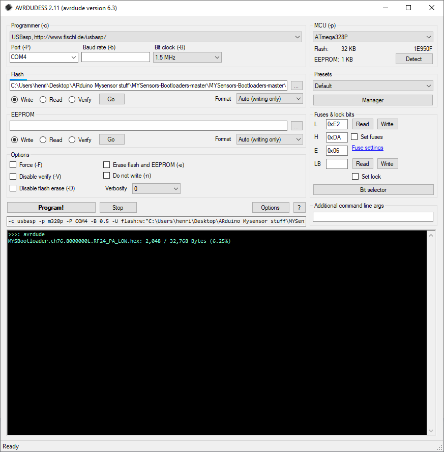
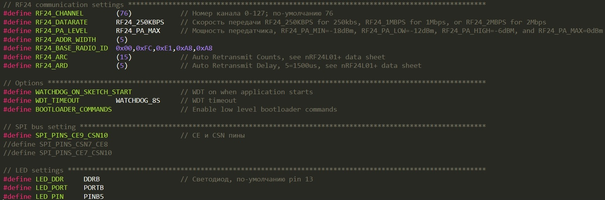
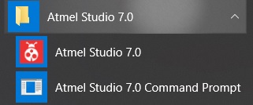
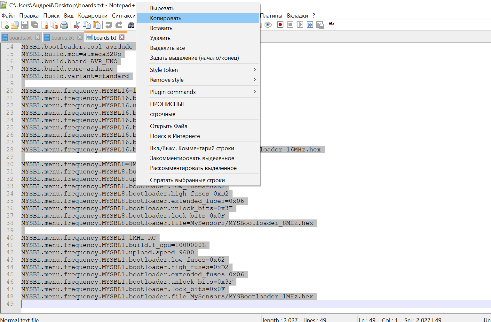
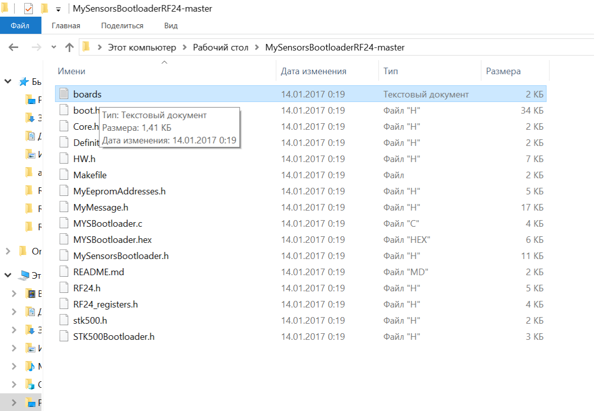

### 1.Установка плат для загрузчика MYSBootloader

- Скачать архив с [поправленной прошивкой](https://github.com/CloneTV/MySensor-Home-Net/archive/master.zip), или с [гита разработчика MYSBootloader](https://github.com/mysensors/MySensorsBootloaderRF24/tree/development) (архив давно не обновлялся)  
- Разархивировать на рабочий стол.  
- Запустить Arduino IDE  
- Зайти в примеры(должна быть выбрана любая из плат Ардуино)  
- Открываете пример EEPROM clear (или любой другой из встроенных в Arduino IDE библиотек, необходимо для того чтобы не искать место где находятся исполняемые файлы программы Arduino IDE)  
- В примере скетча зайти в Скетч → Показать папку скетча  
- В открывшемся окне проводника Windows в адресной строке найти папку avr  
- Перейти в папку avr  
- Найти в папке avr файл boards.txt  
- Открыть файл boards.txt для редактирования  
- Перейти в самый конец файла  
- С новой строки вставить то что находится в файле boards.txt из скаченного архива  
- Сохранить и закрыть.  

  

- В папке avr найти папку `bootloaders`  
- Перейти в нее  
- Создать в папке bootloaders папку `MySensors`  
- В папке из скаченного архива с гита разработчика, перейти в папку hex  
- Из папки hex скопировать все файлы в созданную ранее папку MySensors  
- Закрыть все папки  
- Перезагрузить Arduino IDE  
- В платах Arduino появится ATmega328 with MYSBootloader (Это и есть плата для записи загрузчика MYSBootloader)  

### 2. Прошивка загрузчиком MYSBootloader

Выбрать плату `ATmega328 with MYSBootloader 1.x` в Инструменты → Плата → Платы Arduino AVR → ATmega328 with MYSBootloader  
Выбрать нужный процессор в Инструменты → Процессор →  
Выбрать программатор через который будете загружать прошивку MYSBootloader в Инструменты → Програматор →  
Нажать `Записать загрузчик` в Инструментах →  

## НЕ ЗАГРУЖАЙТЕ СКЕТЧИ ВАШЕЙ ПРОГРАММЫ ЧЕРЕЗ ARDUINO IDE ПОСЛЕ ЗАПИСИ ЗАГРУЗЧИКА ТАК КАК БУДЕТ СТЕРТ САМ ЗАПИСАННЫЙ ЗАГРУЗЧИК MYSBOOTLOADER   

## НЕ ИСПОЛЬЗУЙТЕ `#define MY_OTA_FIRMWARE_FEATURE` В СКЕТЧЕ С `MYSBootloader`! ЭТО ОПРЕДЕЛЕНИЕ РАБОТАЕТ ТОЛЬКО С ЛОАДЕРОМ `Optiboot` И ТРЕБУЕТ ВНЕШНЕЙ ФЛЕШ ПАМЯТИ!  

### 3. Создание загрузчика MYSbootloader

Инструкция как создать загрузчик `MYSbootloader` для `FOTA` со своими параметрами, например, номер канала, скорость передачи, мощность передатчика, CE и CSN пины, может что-то еще..  
- 1. Скачиваем с github архив и распаковываем его желательно ближе к корню и на диск D:\ чтобы не было проблем с записью и меньше писанины путей к данной папке.
- 2. Устанавливаем или открываем `Atmel Studio 7`  
- 3.0.1 Открываем солюшен `MYSBootloaderRF24xx/MYSBootloaderRF24xx.cppproj`. Должны быть указанны переменные пути `%ATMEL_STUDIO% = Atmel Studio 7/base path` и `%ARDUINO_USER_LIB% = Arduino IDE path to user installation library`.  
- 3.1.1 Или, в дальнейшем, после правок, заходим в папку с исходными текстами и запускаем `build.cmd`, или пишем `make`, собирая прошивку в коммандной строке.  
- 3.1.2 Открываем `Atmel Studio 7.0 Command Promt`  
- 4. Открываем в скачанном архиве файл `MYSBootloader.c`,`MySensorsBootloader.h` и вносим свои изменения.. Если `CE` и `CSN` пины не совпадают не с одним из предложенных вариантов необходимо внести изменения в файл `HW.h`.  
- 5. По-умолчанию частота кварца 8MHz и скорость порта 9600, их можно изменить в фаиле `Makefile`  
- 6. После проделанных операций в папке с исходными текстами появится файл `MYSBootloaderRF24xx/MYSBootloader.hex`, который необходимо залить в `Atmega328P`, например с помощью `AVRDUDDES` или `Arduino IDE`.  

### 4. Screen

  
  
  
  
  

### 5. Origin links

- [mysensors.ru/forum 1](https://mysensors.ru/forum/viewtopic.php?f=5&t=501)  
- [mysensors.ru/forum 2](https://mysensors.ru/forum/viewtopic.php?f=5&t=29)  
- [mysensors.ru/fota](https://mysensors.ru/about/fota/)  
- [mysensors.org/fota](https://www.mysensors.org/about/fota)  
- [MYSBootloader](https://github.com/mysensors/MySensorsBootloaderRF24/tree/development)
